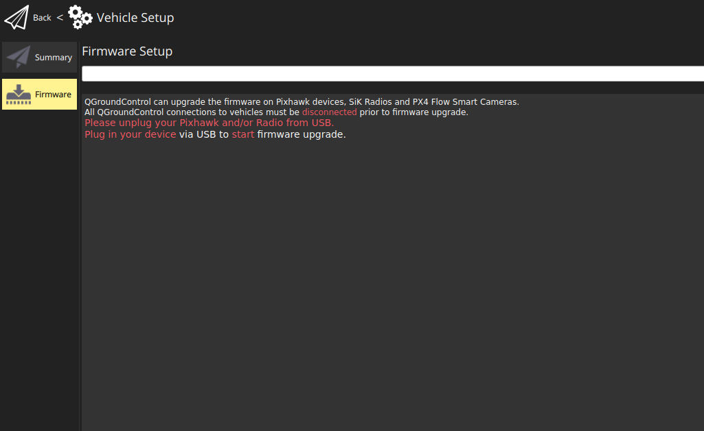

# Este guia busca explicar como configurar o QGroundControl com a firmware correta

Ao entrar no QGC (*olhar último guia*), clique no "Q" no canto superior esquerdo da tela e selecione a opção *Vehicle Setup":

Feito isso, vá em *firmware* e conecte sua PX conforme o programa solicitar:

Ao conectar, aparecerá um menu na lateral direita da tela;

## Marque todas as opções indicadas na figura

E clique em *ok*.

Pronto! Sua firmware deve estar devidamente instalada e sua PX pronta para ser configurada!