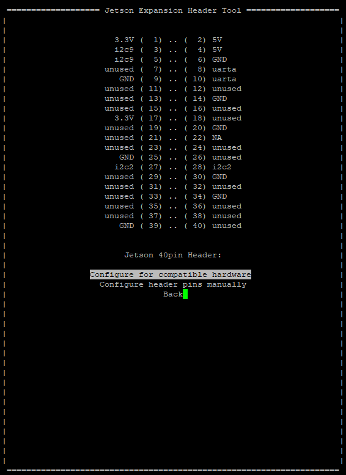

# Setting up and using Jetson GPiO pins

This guide's goal is to teach how to setup and use Jetson Orin Nano's 
GPIO pins, and in then an example application for controlling servos.

## The pins

Jetson has a 40 pin header, providing access to ground, power and interface signal pins.
The functions each one has can be seen below:


### Power pins

power pins are not the focus here, so i'll just paste Nvidea's description

- There are two 3.3V power pins and two 5V power pins. These are not switchable; power is always available when the developer kit is connected to power.
-   The two 5V pins can be used to power the developer kit at 2.5A each. (Do not power the developer  kit via these pins and USB-C connector at the same time.)

### Signal pins

- all signals use 3.3 V

- By default, all interface signal pins are configured as GPIOs, except those supporting I2C and UART 

it is interesting to note that the pins here are very similar to the ones found in most rapberry pi kits, so libraries and configure steps might me similar for both computers

## Configuring Signal Pins

Since JetPack is usually installed by default, Jetson-I/O might be already in your system, so you just need to run it:

```shell
sudo /opt/nvidia/jetson-io/jetson-io.py
```
and then select "Configure Jetson 40pi Header", select wich of the "unused" pins you want to toggle, save and reboot to apply changes. On my use case, i needed to enable PWM and used pin 33 that maps to PWM1 on Jetson Orin Nano.



## Controlling a Servo Motor (Example Use)

Now, for the use we had for these pins, i wanted to control a servo motor with PWM signal. For this, python was used for simplicity, but this guide may be updated in the future with C++.

This will require the Jetson.GPIO library, which can be installed via:

```shell
sudo pip install Jetson.GPIO
```

or 

```shell
git clone https://github.com/NVIDIA/jetson-gpio
cd jetson-gpio
sudo python3 setup.py install 
#or sudo python ...
```
Then, you must set up user permissions and then copy the custom udev rules:

```shell
sudo groupadd -f -r gpio
sudo usermod -a -G gpio your_user_name

sudo cp lib/python/Jetson/GPIO/99-gpio.rules /etc/udev/rules.d/
sudo udevadm control --reload-rules && sudo udevadm trigger
```

For the last step, here is the code that controls the servo: 

```python3
import Jetson.GPIO as GPIO
import time

# Use physical pin numbering
GPIO.setmode(GPIO.BOARD)

# Define pin 33
SERVO_PIN = 33

# Set up pin for PWM at 50Hz (standard for servo motors)
GPIO.setup(SERVO_PIN, GPIO.OUT)
pwm = GPIO.PWM(SERVO_PIN, 50)  # 50Hz frequency

# Start with 0% duty cycle (servo off)
pwm.start(0)

def set_servo_position(position):
    if position == 1:
        duty = 10  # ~2ms pulse (open)
    elif position == 0:
        duty = 5   # ~1ms pulse (close)
    else:
        print("Invalid input.")
        return

    print(f"Setting servo to {'OPEN' if position else 'CLOSE'} (duty {duty}%)")
    pwm.ChangeDutyCycle(duty)
    time.sleep(0.5)  # Allow movement
    pwm.ChangeDutyCycle(0)  # Stop sending signal to prevent jitter

try:
    while True:
        val = input("Enter 1 to OPEN, 0 to CLOSE, or q to quit: ").strip()
        if val.lower() == 'q':
            break
        elif val in ('0', '1'):
            set_servo_position(int(val))
        else:
            print("Please enter 0, 1, or q.")

except KeyboardInterrupt:
    pass

finally:
    pwm.stop()
    GPIO.cleanup()
    print("Cleaned up GPIO and exiting.")
```

