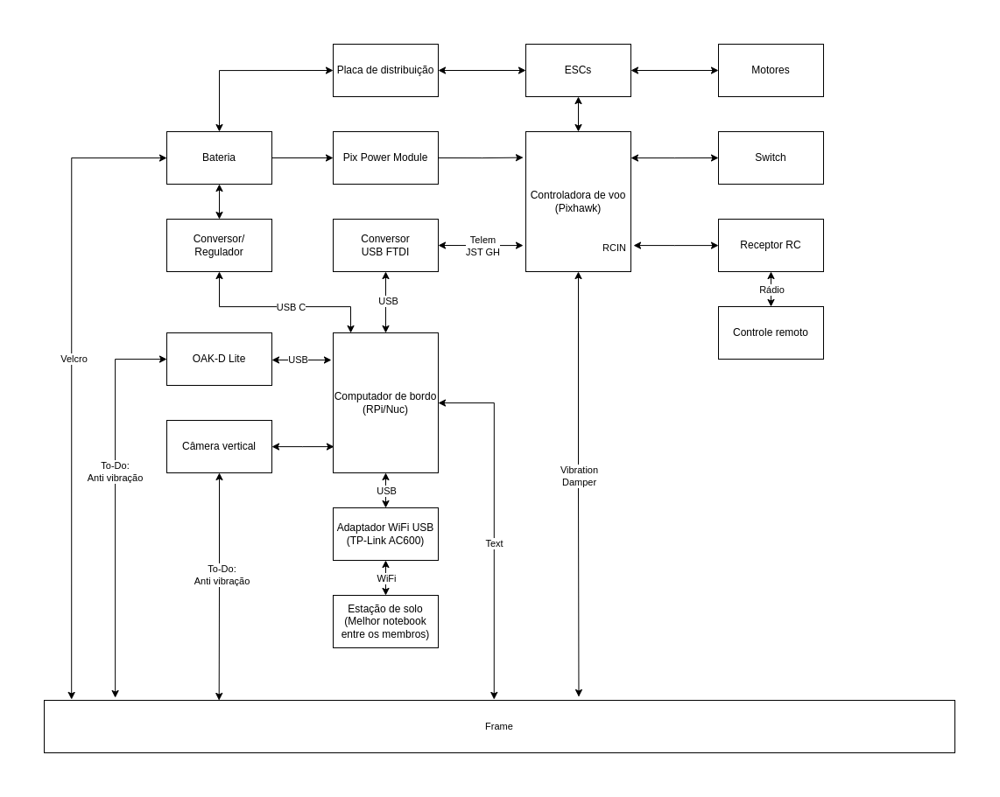

# Diagrama de Montagem

Abaixo, pode-se visualizar um diagram esquemático de como montar o drone, quais são seus principais componentes e como eles são conectados entre si.

Em resumo, os componentes necessários são:

* Frame
* Controladora de voo
* Motores
* ESCs
* Bateria
* Placa de distribuição
* Módulo de potência para Pixhawk
* Switch de segurança
* Receptor de rádio
* Controle remoto
* Conversor USB FTDI
* Conversor/Regulador
* Computador de bordo
* Câmera OAK-D Lite
* Câmera vertical
* Adaptador WiFi USB
* Cabo de telemetria

## Autores

* Profeta T25