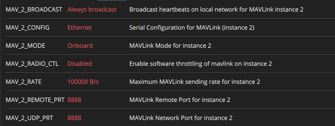

# Conexão com computador de bordo

## Na Pixhawk

No MAVLink Console:

```shell
echo DEVICE=eth0 > /fs/microsd/net.cfg
echo BOOTPROTO=fallback >> /fs/microsd/net.cfg
echo IPADDR=192.168.10.2 >> /fs/microsd/net.cfg
echo NETMASK=255.255.255.0 >>/fs/microsd/net.cfg
echo ROUTER=192.168.10.254 >>/fs/microsd/net.cfg
echo DNS=192.168.10.254 >>/fs/microsd/net.cfg
```

Parâmetros



Faça o reboot da Pixhawk.

## No computador

```shell
sudo nano /etc/netplan/01-network-manager-all.yaml
```

```shell
MicroXRCEAgent udp4 -p 8888
```


## Referências

[1](https://docs.px4.io/main/en/advanced_config/ethernet_setup.html)