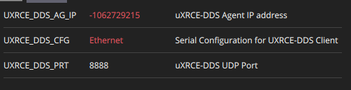

# MicroXRCE Agent Setup

The MicroXRCE Agent is a middleware for sending data from the Pixhawk to the Raspberry without using the MAVLink protocol, and instead using ROS2 topics, which include telemetry. This is useful for offboard control.

We will launch the MicroXRCE-DDS Agent in the Raspberry, and the Client will be launched in Pixhawk. The two will communicate via UDP connection on the Ethernet port.

*You will not be able to connect to QGroundControl through this tutorial, except if you also use ROSBridge and MAVRos (not recommended).*

## Raspberry Pi

Pre-requisites: 
- [Ubuntu 22.04 install](../raspberry_pi/OS-install.md)
- [ROS2 setup, uxrce agent build and ws_sensor_combined workspace](https://docs.px4.io/main/en/middleware/uxrce_dds.html)

We will now configure our Ethernet connection. In terminal:

```shell
sudo nano /etc/netplan/01-network-manager-all.yaml
```
Paste this, then save (press Crtl+X, Y and Enter):

```yaml
network:
  version: 2
  ethernets:
      eth0:
          addresses:
              - 192.168.10.1/24
          nameservers:
              addresses: [192.168.10.1]
          routes:
              - to: 192.168.10.1
                via: 192.168.10.1
  wifis:
    wlan0:
      renderer: networkd
      access-points:
        "wifi_SSID":
          password: "wifi_password"
      dhcp4: true
      optional: true
```

This tells Netplan that the Raspberry Pi will have IP Address 192.168.10.1 and our netmask is /24 (which means mask 255.255.255.0).

Our subnet is 192.168.10.x, so we well use the Pixhawk in IP Address 192.168.10.2

## Pixhawk

Connect Pixhawk to QGroundControl via USB cable.

In MAVLink Console:

```shell
echo DEVICE=eth0 > /fs/microsd/net.cfg
echo BOOTPROTO=fallback >> /fs/microsd/net.cfg
echo IPADDR=192.168.10.2 >> /fs/microsd/net.cfg
echo NETMASK=255.255.255.0 >>/fs/microsd/net.cfg
echo ROUTER=192.168.10.254 >>/fs/microsd/net.cfg
echo DNS=192.168.10.254 >>/fs/microsd/net.cfg
```

`IPADDR=192.168.10.2` sets the Pixhawk IP Address to `192.168.10.2` in the local network, which was what we wanted in previous section.

In Parameters menu, set these:



Attention: set UXRCE_DDS_AG_IP to the IP Address of the Raspberry Pi on the *wifi network*, where it is connected in SSH. Not to be confused with the local ethernet network, where Raspberry has address 192.168.10.1

You can use [this website](https://www.browserling.com/tools/ip-to-dec) to convert IP to int64, which is automatically converted to int32 in QGround.

## Connection

In the Raspberry Pi terminal, launch the uXRCE Agent, which should output the creation of topics.

```shell
MicroXRCEAgent udp4 -p 8888
```

In another terminal, let's launch a listener node to test the connection in ROS2:

```shell
cd ~/ws_sensor_combined/
source /opt/ros/humble/setup.bash
source install/local_setup.bash
ros2 launch px4_ros_com sensor_combined_listener.launch.py
```

If connection is successful, you should see telemetry data being displayed.

## References

[PX4 Ethernet Setup](https://docs.px4.io/main/en/advanced_config/ethernet_setup.html)

[ROS2 and uXRCE Setup](https://docs.px4.io/main/en/ros/ros2_comm.html#install-ros-2)