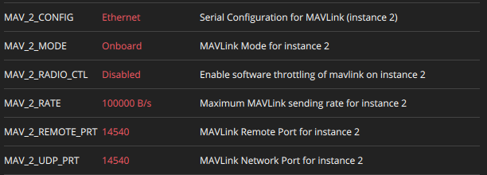
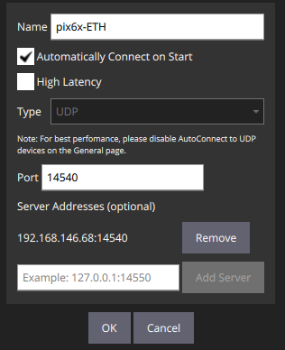

# Send Telemetry via Ethernet in Raspberry Pi

In this tutorial, we will use an Ethernet connection between Raspberry Pi and Pixhawk to send telemetry data to a ground station (QGroundControl) via Mavlink-Router.

## Pixhawk

Connect Pixhawk to QGroundControl via USB cable.

In MAVLink Console:

```shell
echo DEVICE=eth0 > /fs/microsd/net.cfg
echo BOOTPROTO=fallback >> /fs/microsd/net.cfg
echo IPADDR=192.168.10.2 >> /fs/microsd/net.cfg
echo NETMASK=255.255.255.0 >>/fs/microsd/net.cfg
echo ROUTER=192.168.10.254 >>/fs/microsd/net.cfg
echo DNS=192.168.10.254 >>/fs/microsd/net.cfg
```

`IPADDR=192.168.10.2` sets the Pixhawk IP Address to `192.168.10.2` in the local network, which was what we wanted in previous section.

In Parameters menu, set these:



Reboot Pixhawk and disconnect the USB cable.
## Raspberry Pi

Pre-requisites:
- [Ubuntu 22.04 install](../raspberry_pi/OS-install.md)
- [Mavlink-Router install](https://github.com/mavlink-router/mavlink-router)

Configure the Ethernet connection. In terminal:

```shell
sudo nano /etc/netplan/01-network-manager-all.yaml
```
Paste this, then save (press Crtl+X, Y and Enter):

```yaml
network:
  version: 2
  ethernets:
      eth0:
          addresses:
              - 192.168.10.1/24
          nameservers:
              addresses: [192.168.10.1]
          routes:
              - to: 192.168.10.1
                via: 192.168.10.1
  wifis:
    wlan0:
      renderer: networkd
      access-points:
        "wifi_SSID":
          password: "wifi_password"
      dhcp4: true
      optional: true
```

This tells Netplan that the Raspberry Pi will have IP Address 192.168.10.1 and our netmask is /24 (which means mask 255.255.255.0). Our subnet is 192.168.10.x, so we well use the Pixhawk in IP Address 192.168.10.2

Now, configure Mavlink-Router to run on port 14540 (standard for Onboard-Computer):

```shell
sudo nano /etc/mavlink-router/main.conf
```

Paste and then save the file:

```conf
[UdpEndpoint ground]
Mode=Server
Address=0.0.0.0
Port=14540

[UdpEndpoint pixhawk]
Mode=Normal
Address=192.168.10.2
Port=14540
```

Now run Mavlink-Router, which should output Server and Client creation:

```shell
mavlink-routerd
```

## QGroundControl

Go to "Application Settings" > "Comm links" > "Add" > and configure this:



Attention: set Server Address to the IP Address of the Raspberry Pi on the *wifi network*, where it is connected in SSH. Not to be confused with the local ethernet network, where Raspberry has address 192.168.10.1

Click "OK" > "Connect".

If the connection was proper, QGroundControl should now be connected to the Pixhawk.

## References

[PX4 Ethernet Setup](https://docs.px4.io/main/en/advanced_config/ethernet_setup.html)

[Mavlink-Router Documentation and Examples](https://github.com/mavlink-router/mavlink-router)