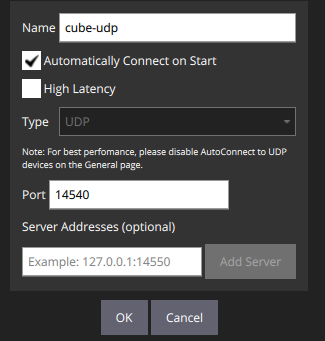

# Send Telemetry via Ethernet in Raspberry Pi

In this tutorial, we will use an UART connection between Raspberry Pi and Pixhawk to send telemetry data to a ground station (QGroundControl) via Mavlink-Router.

The UART connection could be Pixhawk connected directly to the USB hub in Raspberry or connected through a serial connection in pins (soldered cable). See [correct pin configuration](https://github.com/ViniciusAbrao/px4_ros2_xrcedds/blob/master/tutorial/tutorial.md#mavlink-communication)

## Pixhawk

Connect Pixhawk to QGroundControl via USB cable.

In Parameters menu, set these:


Reboot Pixhawk and disconnect the USB cable.

## Raspberry Pi

Pre-requisites:
- [Ubuntu 22.04 install](../raspberry_pi/OS-install.md)
- [Mavlink-Router install](https://github.com/mavlink-router/mavlink-router)

Configure Mavlink-Router to run on port 14540 (standard for Onboard-Computer):

```shell
sudo nano /etc/mavlink-router/pix-uart.conf
```

Paste and then save the file:

```conf
[UartEndpoint alpha]
  #ACM0 for usb, ttyAMA0 and serial0 for serial
  Device = /dev/ttyACM0
  Baud = 57600

[UdpEndpoint ground]
  Mode=Server
  Address=0.0.0.0
  Port=14540

```

Now run Mavlink-Router, which should output Server and Client creation:

```shell
mavlink-routerd -c /etc/mavlink-router/pix-uart.conf
```

## QGroundControl

Go to "Application Settings" > "Comm links" > "Add" > and configure this:



Click "OK" > "Connect".

If the connection was proper, QGroundControl should now be connected to the Pixhawk.

## References

[Correct Serial Pins Configuration](https://github.com/ViniciusAbrao/px4_ros2_xrcedds/blob/master/tutorial/tutorial.md#mavlink-communication)

[Mavlink-Router Documentation and Examples](https://github.com/mavlink-router/mavlink-router)