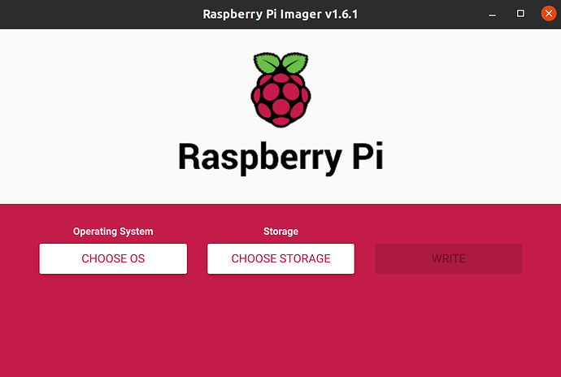
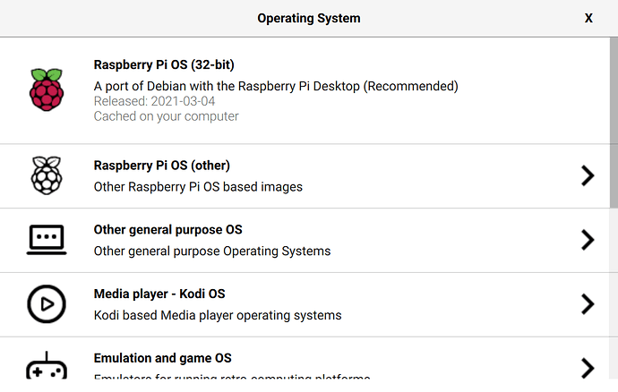
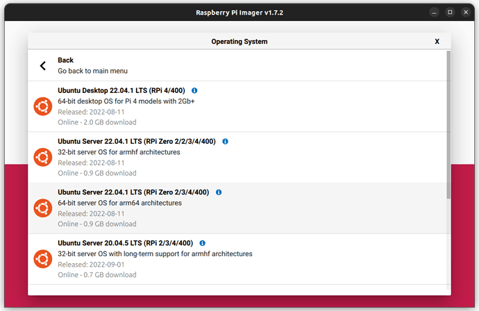

# Como instalar um sistema operacional

Esse tutorial tem a finalidade de ensinar como instalar um sistema operacional na Raspberry Pi, com foco no Ubuntu Server 22.04, atualmente utilizado pela equipe.

## Prepare o cartão SD

Separe um cartão microSD e insira-o no seu computador.

Você precisará do `Raspberry Pi Imager`. Para instalá-lo, acesse um dos links a seguir:

- [Raspberry Pi Imager for Ubuntu](https://downloads.raspberrypi.org/imager/imager_latest_amd64.deb)
- [Raspberry Pi Imager for Windows](https://downloads.raspberrypi.org/imager/imager_latest.exe)
- [Raspberry Pi Imager for macOS](https://downloads.raspberrypi.org/imager/imager_latest.dmg)

No Ubuntu, você só precisa rodar o seguinte comando:

```shell
sudo snap install rpi-imager
```

Abra o aplicativo e selecione `CHOOSE OS`:



Após isso, clique em `Other general purpose OS`.



Escolha o Ubuntu Server 22.04 para arm64.



Clique em `CHOOSE STORAGE` e escolha seu cartão SD. Após isso, selecione o ícone de configuração.

## Opções avançadas

Selecione `set hostname` e escolha um nome. Em geral, usamos `rpi-ubuntu` para o hostname, descrevendo o aparelho e o OS usado.

Em `Enable SSH`, selecione a opção `Use password authentication`.

Configure o nome do usuário e a senha. O padrão é utilizar `evtol` e `boradronezada`, respectivamente.

Por fim, é recomendado configurar uma rede Wi-Fi de início. Dessa forma, não é necessário conectar a RPi a um monitor em nenhum momento.

## Referências

[Ubuntu Server Install](https://ubuntu.com/tutorials/how-to-install-ubuntu-on-your-raspberry-pi#1-overview)