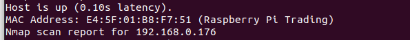

# Conexão remota por SSH

Esse tutorial tem a finalidade de ensinar como configurar e usar o SSH para estabelecer uma conexão remota entre a RPi e o computador.

## Descubra o IP da Raspberry

### Método 1: a partir da Raspberry Pi

Nesse método, será necessário um monitor e um teclado USB.

Primeiramente, conecte os periféricos e, então, ligue a RPi. Depois que o sistema inicializar, será pedido o usuário e a senha. Uma vez logado, digite o seguinte no terminal:

```
hostname -I
```

Anote o IP.

### Método 2: sem Raspberry Pi

Encontre o IP do roteador, seguindo esse [tutorial]().

[Aqui](https://www.makeuseof.com/ways-to-find-raspberry-pi-ip-address/) temos alguns métodos de como descobrir o IP da RPi a partir do IP do roteador. Vou descrever o que uso no Ubuntu.

Instale o nmap:

```shell
sudo snap nmap
```

Use o nmap.

```shell
sudo nmap -sn [Your router's IP address]/24
```

Caso apareça esse erro:

```shell
dnet: Failed to open device eth0 after installing NMAP.
QUITTING!
```

Eu encontrei a solução no StackOverflow - [After installing NMAP: dnet: Failed to open device eth0?](https://stackoverflow.com/questions/59571784/after-installing-nmap-dnet-failed-to-open-device-eth0)


Se o comando funcionar, você poderá encontrar o IP da RPi.



## Conecte usando SSH

Digite o seguinte no terminal:

```shell
ssh evtol@<IP>
```

Escreva a senha do usuário e você estará conectado.

## Referências

